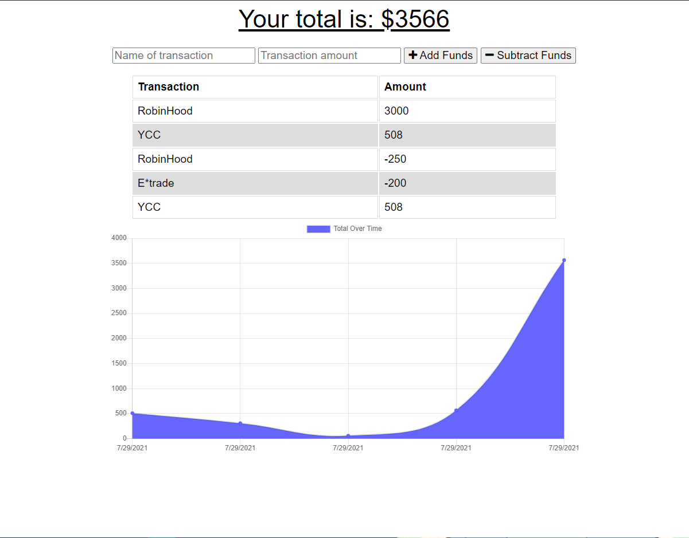

# Budget Tracker Starter Code
Url to this repository: https://github.com/LifeInvaderr/Budget-Tracker

Url to the deployed version: https://budgeted-trackerrr.herokuapp.com/

## Description
With Budget Tracker, any user could track their daily budget on the fly. Built with offline capability as well as the ability to download as an app for chrome

## Table of Contents
* [Installation](#installation)
* [Usage](#usage)
* [Questions](#questions)

## Installation
To install this file, either clone or install the zip version of this repository.

Once installed, you will need to do an `npm install` to download the needed node modules.

To run locally, please use `npm start` to initiallize the file.

## Usage
With Budget Tracker, the user will be able to track their daily income aswell as their expenses.

## Questions
For any questions or concerns, please email me at matthewkausfox@gmail.com

Thank you!
